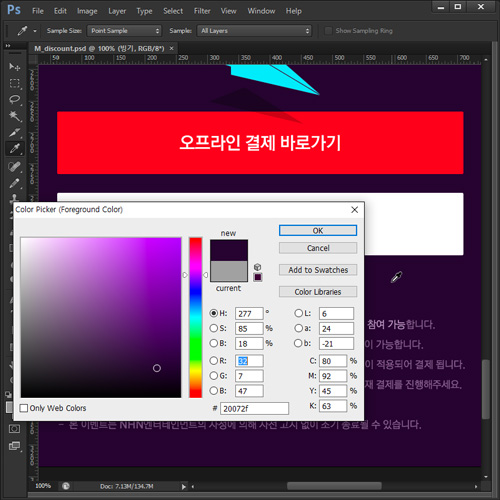
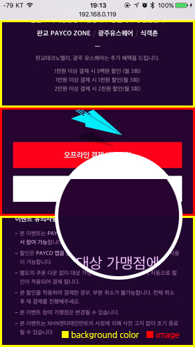
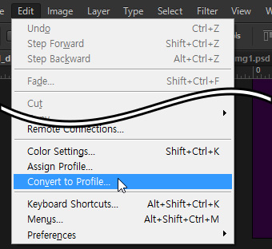
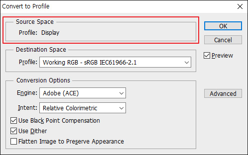
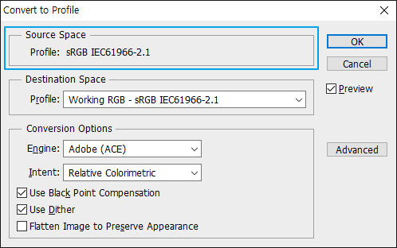
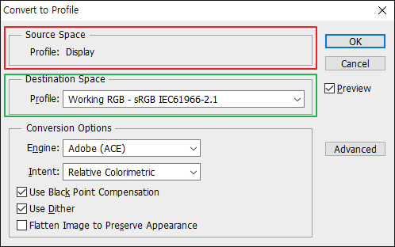
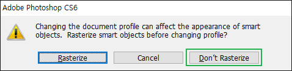
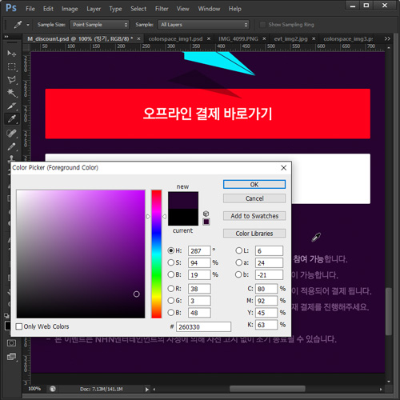
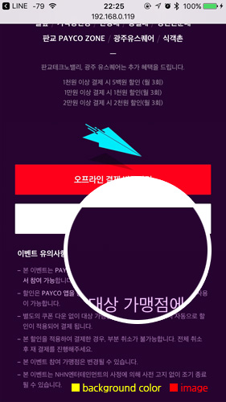

# PSD에서 저장한 이미지가 색이 달라요
(제목이 바뀌어야 할 듯 하다. 인터넷과 색공간 쯤으로 해야되나.)

**\* 글 수정 방향성 요약**

- w3c에서 지정한 표준 색공간은 sRGB이다
- 웹브라우저 컬러매니지먼트 지원 -> 이미지 ICC 프로파일 해석이 가능
- 최신 웹브라우저들은 컬러매니지먼트 지원으로 sRGB가 아닌 이미지여도 문제가 없음
- 그러나 컬러매니지먼트를 지원하지 않는 IE8 이하 대응의 경우 sRGB를 사용해야 함
- IE8 이하 대응을 하지 않는다고 해도 표준아닌 색공간 사용의 위험성 등

*****

## 문제점

마크업을 하다 보면 디자인 원본 파일에서 추출한 컬러 값과 저장한 이미지의 색상이 서로 다른 경우가 발생 합니다.    
주로 이미지로만 이루어져 있는 페이지보다 이미지와 배경색이 같이 사용하는 경우에 발견 됩니다.

 

미미한 차이이긴 하지만 분명 서로 다른 색으로, 실제로 컬러가 다르다고 QA 대상이 되는 경우도 종종 있습니다.    
이런 문제점은 왜 발생하고 또 어떻게 해결해야 할까요?    
이 문제점을 해결하기 위해 색 공간과 ICC 프로파일에 대해 조금 알아 봅시다.

## 색 공간과 ICC 프로파일

>인터넷 표준 색 공간은 **sRGB**입니다.

### 색 공간이란?
>색의 3속성인 색상(hue), 명도(lightness), 채도(chroma)를 3차원 공간의 각각의 축으로 형성된 색 공간은 컬러 디자인이나 컬러 공학 등의 학문 또는 산업분야에서 컬러를 다루는 데 있어서 기본적으로 이해하여야 할 개념이다.
색 공간에 대한 개념 및 설명에 대해서는 [위키백과](https://ko.wikipedia.org/wiki/%EC%83%89_%EA%B3%B5%EA%B0%84)를 참조하세요.

주목해야 될 부분은 해당 문서 내에 **자주 쓰이는 색 공간** 중 **RGB 색 공간**에 대한 내용입니다.

>RGB 색 공간은 색을 혼합하면 명도가 올라가는 가산 혼합 방식으로 색을 표현한다. RGB 가산혼합의 삼원색은 빨강(Red), 녹색(Green), 파랑(Blue)을 뜻한다. RGBA은 RGB와 동일하며, 알파(Alpha)라는 투과도를 덧붙인 것이다. RGB 색 공간은 삼원색에 해당하는 세 가지 채널의 밝기를 기준으로 색을 지정한다. RGB 색 공간은 웹 색상 표현의 기본 원리이다.

### sRGB(Standard RGB)
>sRGB는 1996년에 미국의 컴퓨터 기업인 마이크로소프트와 HP가 협력하여 만든 모니터 및 프린터 표준 RGB 색 공간이다.
>
>- RGB 색 공간의 종류 중 하나
>- PC 모니터 및 프린터 표준 색 공간
>- **W3C에서 정한 인터넷 표준 색 공간**

### ICC 프로파일
>국제 컬러 협회(International Color Consortium, 줄여서 ICC)는 8개 산업 업체가 모든 운영 체제와 소프트웨어 패키지에 걸쳐 서로 호환성 있게 기능하는 공통 색 관리 시스템을 만들 목적으로 1993년에 세운 것이다.
>현재 버전 4인 ICC 규격은 응용 프로그램, 운영 체제 사이를 오갈 때, 또 창작에서 마지막 인쇄에 이르기까지 색의 흐트러짐이 없게 해 준다.
>ICC 프로파일의 포맷을 정의하는 것이 ICC의 강점이며 이 프로파일은 특정한 장치의 색 특성을 정의하거나 색 공간, PCS(프로파일 연결 공간)의 매핑 정의에 필요한 요구 사항을 보여 준다.

포토샵으로 작성 된 디자인 원본 파일,    
그리고 포토샵을 통해 저장하는 이미지 파일들에는 이 ICC 프로파일 데이터도 같이 포함이 되어 있습니다.

포토샵에서 Save for Web을 통해 이미지를 저장하게 되면 sRGB 색 공간 정보를 담은 ICC 프로파일을 적용하여 파일이 저장 됩니다.

## 해결방법
자, 그럼 포토샵의 Save for Web으로 저장을 한 이미지는 sRGB 프로파일이 적용되어 저장되어 있다는 것을 알았습니다.    
그런데 원본 파일에서 색을 찍어 컬러값을 입력해 보면 왜 이미지와 다른 것일까요?

**혹시 원본 이미지의 프로파일이 sRGB가 아닌 것은 아닐까?!**

### 확인 해봅시다
문제가 되는 파일을 열어 `Edit > Convert to Profile...` 클릭 후 `Source Space`를 확인 해봅시다.

 

Profile이 Display라는 것으로 되어 있습니다.

정상적인 프로파일의 상태를 한 번 보죠.

Profile에 **sRGB IEC61966-2.1** 이라고 쓰여 있습니다.
이 프로파일이 우리가 찾는 표준인 sRGB의 프로파일입니다.

### 우째 이런일이?
파일을 제작한 포토샵의 설정에서 작업공간의 컬러 프로파일이 sRGB가 아닌 다른 프로파일이 적용이 되어있어서    
파일이 저장될 때에도 해당 프로파일의 정보가 같이 따라다니게 됩니다.

그럼 이거 어떻게 해야 하나요?

### 그것을 알려주마
위에서 표준 프로파일이 **sRGB IEC61966-2.1**인 것을 알게 되었습니다.    
이 프로파일로 변환을 해주면 됩니다.

1. 프로파일을 확인했을 때와 같은 방법으로 `Edit > Convert to Profile...`을 클릭합니다.
2. `Destination Space`의 Profile 셀렉트박스에서 `Working RGB - sRGB IEC61966-2.1`을 선택합니다.
3. `OK`를 클릭하면 경고창이 하나 뜹니다.
4. Don't Rasterize를 클릭하면 프로파일이 변환됩니다. (파일 크기에 따라 변환시간이 걸릴 수 있습니다.)
 - Rasterize를 클릭하면 모든 Layer가 병합되면서 프로파일이 변환됩니다. Layer가 병합되면 안되겠죠?
 - Don't Rasterize를 클릭하면 Layer가 병합되지 않으면서 프로파일이 변환됩니다.

자, 눈으로 보기엔 변한 것 같지 않아 보일 수 있습니다.    
하지만 이제 배경 컬러 값을 다시 찍어보죠.

 

컬러 값이 바뀌었고 css를 작성해서 적용해보면 이미지와 배경 컬러가 같아졌습니다.

앞으로는 이런 현상에 발생했을 때 당황하지 마시고,    
파일의 컬러 프로파일을 확인 해 본 뒤, 변환해서 사용하면 됩니다.

***

#### 참고문헌
- W3C - [A Standard Default Color Space for the Internet - sRGB](https://www.w3.org/Graphics/Color/sRGB.html)

#### 참고링크
- 위키백과 - [색 공간](https://ko.wikipedia.org/wiki/%EC%83%89_%EA%B3%B5%EA%B0%84), [sRGB](https://ko.wikipedia.org/wiki/SRGB), [국제 컬러 협회(ICC)](https://ko.wikipedia.org/wiki/%EA%B5%AD%EC%A0%9C_%EC%BB%AC%EB%9F%AC_%ED%98%91%ED%9A%8C), [ICC 프로파일](https://ko.wikipedia.org/wiki/ICC_%ED%94%84%EB%A1%9C%ED%8C%8C%EC%9D%BC)